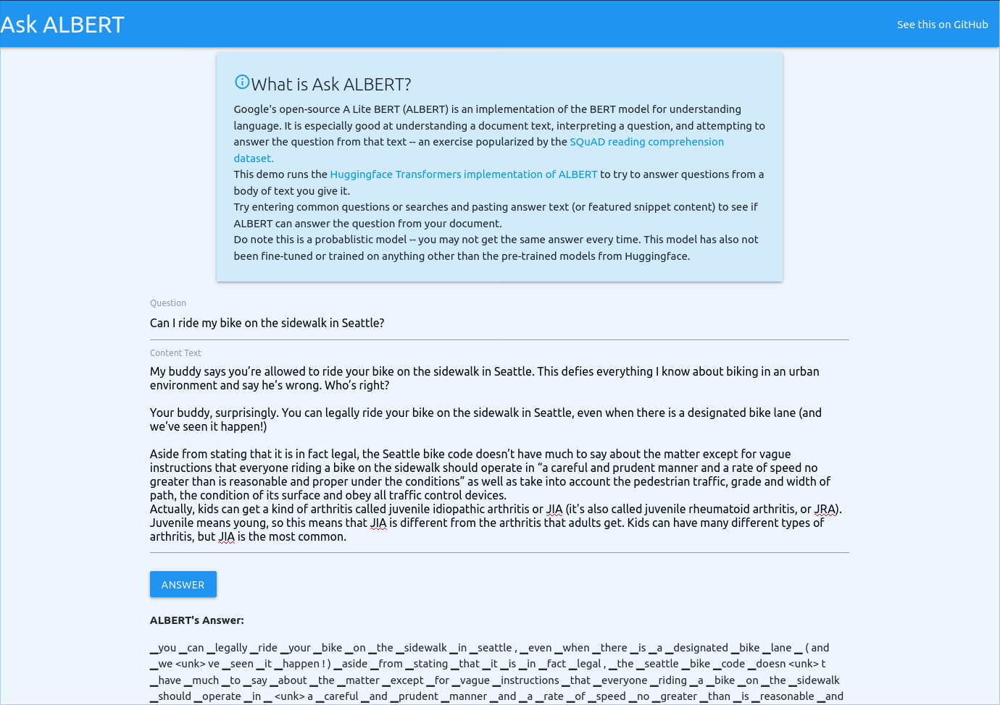

# ALBERT API for Question Answering

An exploration in using Google's
[ALBERT](https://ai.googleblog.com/2019/12/albert-lite-bert-for-self-supervised.html)
method for training NLP models to build a question answering service.

The goal is to build an API that -- given some document text and a question --
can predict how well an algorithm can answer that question from a document.

This project leverages [Huggingface's
Transformers](https://huggingface.co/transformers/model_doc/albert.html)
implementation of the ALBERT model.

## Pre-Requisites

This project uses Docker to handle Python environments, networking, and the
like. Please ensure you have it [installed](https://docs.docker.com/install/) on
your machine.

## Setup

The project Makefile handles fetching dependencies, building Docker images, and
running the project.

Some helpful commands:

- `make run`: runs the Albert API service
- `make run-repl`: opens a Python REPL in the container with all the library
  dependencies installed and available
- `make run-sh`: opens a shell in the container with all the library
  dependencies installed and available
- `make build`: builds the Docker image
- `make transformers`: checks out the Huggingface transformers project

## Demo App

This project comes with a simple HTML UI to try out ALBERT. Open your Terminal
application to the folder where you downloaded htis code and run `make run`.



Wait for the `Running on http://0.0.0.0:5000/` message in your console and then
open your browser to `http://0.0.0.0:5000`.

Note, the first document you analyze may take time to download the required
models.

Press CTRL+C to quit.

## Command-Line Usage

This project comes with a script to run examples. First, make sure you have
read and completed the steps in the Pre-Requisites section.

*NOTE*: this script is written in `bash`, so you need either Linux or Mac to run
it. You could try [Windows Subsystem for
Linux](https://docs.microsoft.com/en-us/windows/wsl/install-win10) but I can't
test on that.

Open a terminal and run `make run` to boot up a server. You should see some logs
as it boots up. Wait until you see `Running on http://0.0.0.0:5000/ (Press
CTRL+C to quit)`.

Leave this running. In a separate terminal, run the following:

```
$ echo 'Jen Henson was a nice muppet.' > example.txt
$ ./run-api.sh load example.txt
00dLViX04XwGhw== # Note, this is an ID the API will return
```

This will return an ID for that document. Copy that into your clipboard.
Then ask a question to the API and ALBERT will try to answer it from its
contents.

```
$ ./run-api.sh ask 00dLViX04XwGhw== "Who was Jim Henson?"
▁henson ▁was ▁a ▁nice ▁muppet
```

*NOTE*: On your first run, the transformers library will download pre-trained
models. You'll see this progress in the terminal window running the server.

ALBERT is a model that works on probabilities and likelihoods. You may get
different results when you shut down and start the server back up again.

## Contributing

This is where you come in. This should be more reliable. I don't have deep
experience with Machine Leanring, NLP, or even Python for that matter.

I'm considering a few things to try:

- Find some examples of search queries, feature snippets, and the web page
  contents they come from as training data to finetune the model
- Continue refining the Python setup; I have no idea if I did it right and the
  documentation is a bit scarce
- Explore returning a "probability" or "likelihood" rather than a binary
  "yes/no" on an "answerability" score
